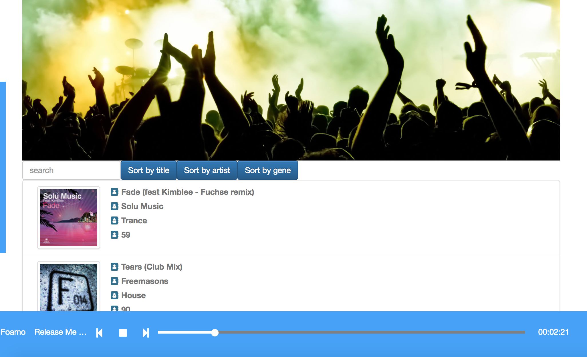
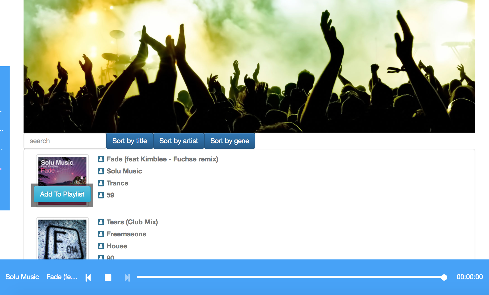

## music player




### structures
1. client entry files are in /client/.
2. main react components are in /imports/ui.
3. all data is saved inside mongodb, and can be required from /imports/api/songs.js

### for developments
1. install meteor
```
curl https://install.meteor.com/ | sh
```

2. install all the dependecies
```
npm i
```

3. run the app
```meteor```


